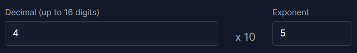
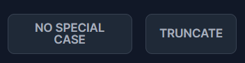
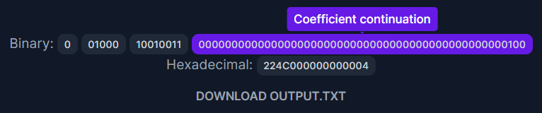

# 
 [DEC64.](https://dec64float.pages.dev/)

DEC64. is a web application that converts IEEE-754 Decimal-64 floating-point to binary or hexadecimal equivalent (including all special cases). This is a simulation project for CSARCH2.

## Usage

To use the DEC64 converter:
1. Enter a decimal number in the Decimal input field. For example `4` in **4** x 105

2. Enter an exponent number in the Exponent input field. For example `5` in 4 x 10**5**
 
3. Optionally, you can select a special case and rounding off method from the listed options. By default, it is `No special case` and `Truncate` respectively.
4. Click `Convert` to get the binary and hexadecimal output.

5. You can hover the outputs to get more info, and you can optionally download the outputs as a text file.

To see more inputs or sample cases, [click here](https://docs.google.com/spreadsheets/d/1vgMkI2yRnTjoUBvBne_0l-Z10zOhqDTlyu54O9-gDoM/edit?usp=sharing).

## Installation

To install and run the project locally, follow these steps:

1. Clone the repository: `git clone https://github.com/ubergonmx/dec64..git` and navigate to the project directory.
2. Open terminal/cmd and install dependencies: `npm install`
3. After the installation of npm packages, type `npm run dev`
4. Open the URL given in the console.

## Tools/Framework used
The project was built using the following:
- React: a JavaScript library for building user interfaces
- Tailwind CSS: a utility-first CSS framework
- Daisy UI: a Tailwind CSS component library
- TypeScript: a typed superset of JavaScript
- Vite: a build tool and development server

## Team Members
- Aaron Palpallatoc (Tech Lead)
- Gelson Sze (Frontend developer)
- Sean Umpad (QA)